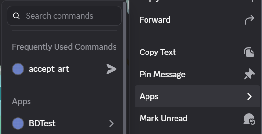

# Accepting Art

Accepting art requires the **Can Accept** permission. Users can accept art posted in an art thread using the **accept-art** context menu command on the message containing the art they want to accept.

Once you run the command, the thread's starter message will be edited to reflect the recent art changes. If an acception message is configured in package settings, the bot will send it to the user. Additionally, if an acception reaction is configured, the bot will react with that emoji to the message.

Accepting art does **NOT** update the credits for a countryball. Credits must be updated manually to reflect art changes.
