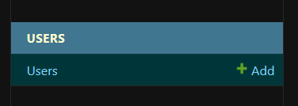
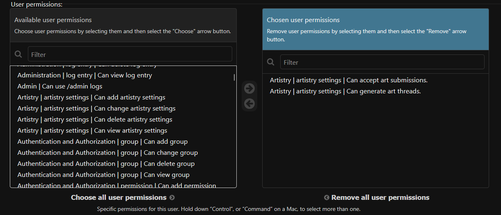

# Permissions

Permissions are required for running certain Artistry commands unless the user is the bot owner.

+------------------+--------------------------------------------------------+
| Permission       | Details                                                |
+==================+========================================================+
| Can Generate     | Determines if a user can generate art threads.         |
+------------------+--------------------------------------------------------+
| Can Accept       | Determines if a user can accept art.                   |
+------------------+--------------------------------------------------------+

## Modifying Permissions

You can modify a user's permissions through the Django admin panel if the user has an account. Navigate to the **User** model and find the user you want to modify.

After you locate the user, you can edit the user's permissions.

Click *save* and the permission changes will reflect immediately.

## Utilizing Groups

**Groups** are helpful for managing permissions. Most modern community-made art systems use a **Content Team** role for users who are responsible for accepting art. Since Artistry utilizes Django permissions, you can make a *Content Team* group to simplify the permission process.
